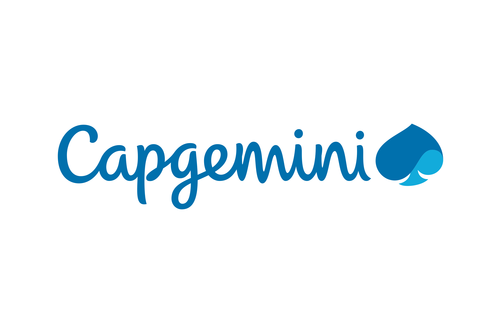

<div align="center">



# AI Product Crafting Lab — Boilerplate

### Lab 2 · Product Crafting · Capgemini

**Describe an app in plain words. Watch it get built. In 2 hours. No code, ever.**

📅 **Lab date — June 18, 2026**

<br />

[](https://nextjs.org)
[](https://react.dev)
[](https://www.sqlite.org)
[](https://nodejs.org)
[](#-quick-start)

</div>

---

## ✨ What is this?

This is the official starter kit for the **Capgemini AI Product Crafting Lab — Lab 2**.

The idea is simple and a little radical: a **senior, non-technical executive** has **2 hours** to build any small app they can imagine. They describe the idea in everyday language to an AI assistant — and the assistant builds **all of it**. The executive never writes, reads, or touches a single line of code.

This repository is the **blank canvas** they start from. It already has everything wired up so the focus stays on the *idea*, not the plumbing.

> **In one line:** you talk, the app appears.

---

## 🎯 Why this boilerplate exists

With only **2 hours** on the clock, every minute spent installing tools, wiring a database, or configuring a framework is a minute stolen from building.

**This starter exists to make the Lab of June 18, 2026 dramatically faster to set up.** Everything that usually eats the first hour is already done:

- ✅ Framework, database, and skills **pre-wired** — `npm install && npm run dev` and you're live.
- ✅ A clean canvas that's **ready to build on**, not a blank folder to assemble.
- ✅ The assistant's **playbook and guardrails** already in place, so it builds fast and speaks in plain words from the very first message.
- ✅ **Mac and Windows readiness checks** (`/diagnostic-mac` and `/diagnostic-windows`) so helpers can confirm a machine is good to go *before* the Lab starts.

The result: builders open the project and start creating in **minutes**, not in an hour of setup.

---

## 🎯 Who it's for

| You are… | What you do |
|---|---|
| 🧑‍💼 **A COMEX / executive builder** | Describe your idea in plain words. That's it. |
| 🤝 **A Lab helper / IQ Project team** | Make sure the machine is ready and unblock anything technical. |
| 🛠️ **A curious developer** | Explore a minimal, modern Next.js + local-database starter. |

---

## 🚀 Quick start

```bash
npm install
npm run dev
```

Then open **<http://localhost:3000>**.

You'll see an empty Capgemini screen — that's your blank canvas. Just tell the assistant what you'd like to build, for example:

> *"Build me a mini CRM to keep track of my contacts."*

…and it appears right there.

---

## 🧩 What's inside

Everything you need is already set up — nothing to configure.

- ⚡ **Next.js 16 + React 19** (App Router) — the modern web framework powering the app.
- 💾 **Built-in local database** — anything your app needs to remember is saved automatically to a single `app.db` file in this folder. **No accounts, no cloud, no setup.** Defined in `lib/db.js`.
- 🎨 **A clean landing page** (`app/page.js`) — your starting canvas, replaced by whatever you build.
- 🧠 **Project skills** that travel with the folder (`.codex/skills`):
  - **`/givemeideas`** — a short, executive-friendly menu of app ideas to spark your build.
  - **`/diagnostic-mac`** — a technical readiness check for Capgemini Macs.
  - **`/diagnostic-windows`** — a technical readiness check for Capgemini Windows PCs.
  - **`/kickoff`** — prepares, checks, starts, and previews the starter for the participant.
- 📋 **`AGENTS.md`** — the full playbook the AI assistant follows to talk in plain words and build fast.

You never need to touch any of this yourself.

---

## 💡 Ideas to get started

Not sure what to build? Type **`/givemeideas`** in the assistant, or pick one of these:

1. **🗂️ Personal Mini CRM** — centralize your contacts and track opportunities.
2. **📊 Delivery Risk Cockpit** — spot project delivery risks early.
3. **🔍 Internal Expertise Finder** — quickly find the right experts inside the company.
4. **📝 Proposal Factory** — generate structured commercial proposals automatically.

---

## 🛠️ How it works (behind the scenes)

```
You describe an idea  →  The AI assistant builds it  →  It shows on screen  →  "What's next?"
```

- The assistant runs the loop **Hear → Build → Show → Ask what's next**, getting something visible fast, then improving it.
- It speaks in **plain words only** — no jargon — and fixes anything that breaks without handing back errors.
- Data is saved **silently and locally**. If your app needs to remember something, it just remembers it.

---

## 🧰 Useful commands (for helpers)

| Command | What it does |
|---|---|
| `npm install` | Install everything the project needs. |
| `npm run dev` | Start the app at `http://localhost:3000`. |
| `npm run build` | Check that the whole app compiles. |
| `npm run lint` | Check code quality. |
| `npm run preflight` | Run lint **and** build together — the readiness check. |

---

## 📁 Project structure

```
.
├── app/                 # The web app (pages, layout, styles)
│   ├── page.js          # The landing canvas
│   ├── layout.js        # Shared page shell
│   └── globals.css      # Styling
├── lib/
│   └── db.js            # Local database (your app's memory)
├── .codex/skills/       # /givemeideas, /diagnostic-mac, /diagnostic-windows, and /kickoff skills
├── public/              # Images and static assets
├── AGENTS.md            # The assistant's full playbook
└── app.db               # Your saved data (created automatically)
```

---

<div align="center">

**Capgemini · AI Product Crafting Lab — Lab 2 · June 18, 2026**

*Built for people with great ideas and no time to code.*

</div>
